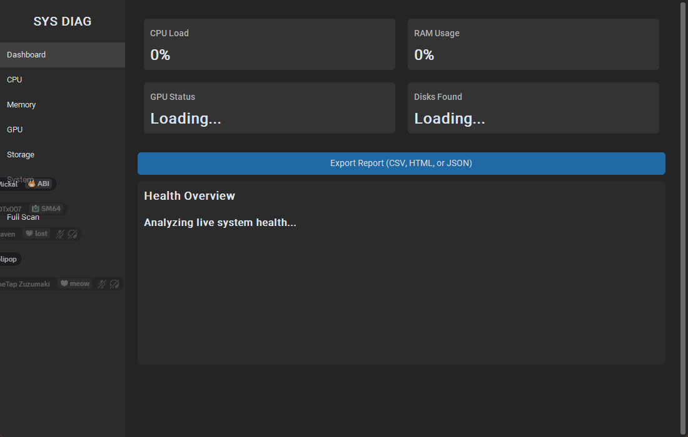
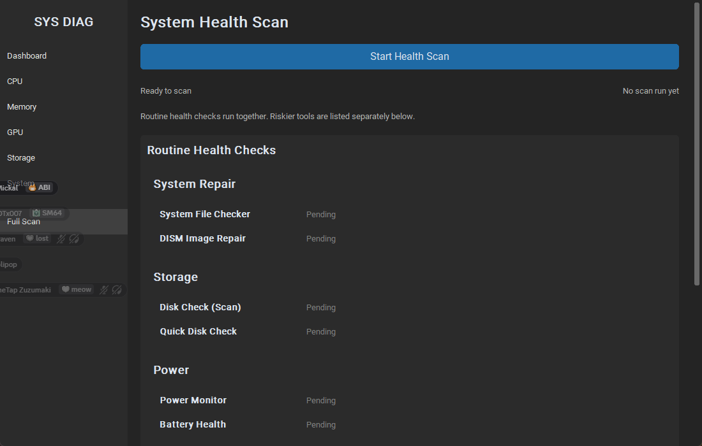

# Master Sentinal

[](https://github.com/SSS-R/Master-Sentinal/actions/workflows/tests.yml)
[](LICENSE)
[](https://www.python.org/)

Master Sentinal is an open source Windows diagnostics app with a live system dashboard, a guided health scan, and exportable reports for troubleshooting.

The app focuses on practical PC health checks:

- live CPU, memory, GPU, disk, and motherboard details
- health findings with severity, persistence, and recommended actions
- routine repair checks such as SFC, DISM, CHKDSK, and power diagnostics
- advanced tools for driver and memory troubleshooting
- CSV, HTML, and JSON reports for sharing and bug reports

## Screenshots




## Download And Run

You do not need Python to use the packaged app.

1. Open the [Releases](https://github.com/SSS-R/Master-Sentinal/releases) page.
2. Download the latest `Master Sentinal.exe`.
3. Launch it and approve the Windows elevation prompt when shown.

The packaged build requests administrator rights because several Windows diagnostics require elevation.

## Run From Source

### Requirements

- Windows 10 or Windows 11
- Python 3.11 or newer
- PowerShell

### Setup

```powershell
git clone https://github.com/SSS-R/Master-Sentinal.git
cd "Master-Sentinal"
python -m venv venv
.\venv\Scripts\Activate.ps1
python -m pip install --upgrade pip
python -m pip install -r requirements-dev.txt
```

### Start The App

```powershell
python .\UnifiedDiagnostics\main.py
```

### Run Tests

```powershell
python -m pytest
```

### Build The Executable

```powershell
python .\build_app.py
```

The packaged executable is written to `dist\Master Sentinal.exe`.

## Supported Windows Versions

Master Sentinal is intended for:

- Windows 10
- Windows 11

Most live metrics should work on current Windows 10 and 11 installs. Some deeper diagnostics depend on local Windows components, available services, hardware support, or admin access.

## Permissions And Diagnostic Safety

Master Sentinal mixes safe read-only checks with a few tools that can change system state or require a reboot.

| Area | Requires admin | Notes |
| --- | --- | --- |
| Live dashboard metrics | Usually no | Some security and BitLocker details may be limited without elevation |
| Routine health scan | Yes | SFC, DISM, CHKDSK, and power diagnostics need admin access |
| Driver Verifier | Yes | Intended for advanced troubleshooting and can make systems unstable |
| Memory Diagnostic | Yes | Schedules a reboot-based memory test |
| Report export | No | Exports the current snapshot to CSV, HTML, or JSON |

See [docs/diagnostics-and-permissions.md](docs/diagnostics-and-permissions.md) for a fuller command safety guide.

## Project Layout

- `UnifiedDiagnostics/` application code
- `tests/` automated tests
- `packaging/` Windows version metadata and packaging assets
- `.github/` workflow and repository templates

## Support

Master Sentinal is free and open source, and it will always be free. If it
helped you, the best ways to support the project are:

- ⭐ Star the repository on GitHub so more people find it
- 🐛 Report bugs or suggest features via [Issues](https://github.com/SSS-R/Master-Sentinal/issues)
- 🔧 Contribute code — see [CONTRIBUTING.md](CONTRIBUTING.md)
- ❤️ Optional donations are welcome but never required

When reporting a bug, you can attach a diagnostic bundle (Dashboard → **Export
Diagnostic Bundle**). Choose **Anonymize** when prompted to automatically remove
your Windows username, PC name, and hardware serial numbers before sharing.

## Contributing

Please read [CONTRIBUTING.md](CONTRIBUTING.md) before opening a pull request.

## License

This project is licensed under the [MIT License](LICENSE).
